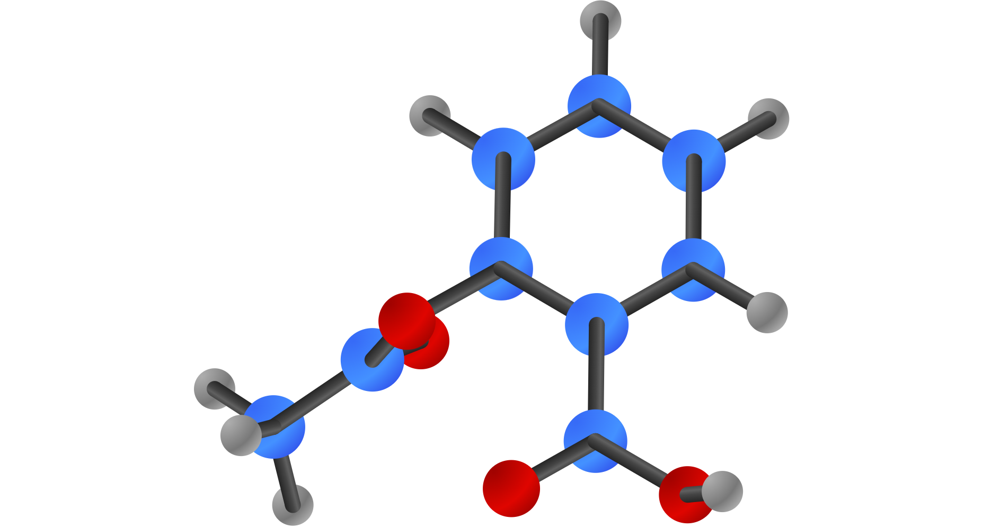
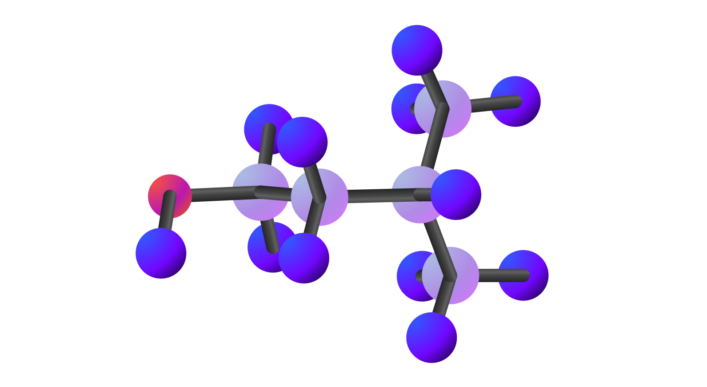
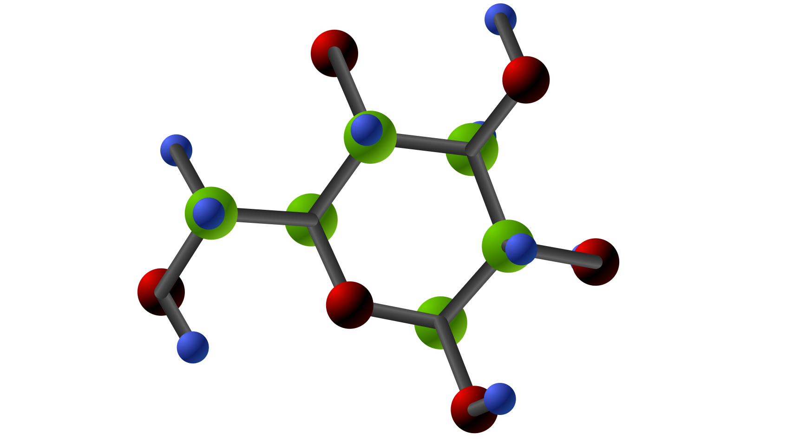
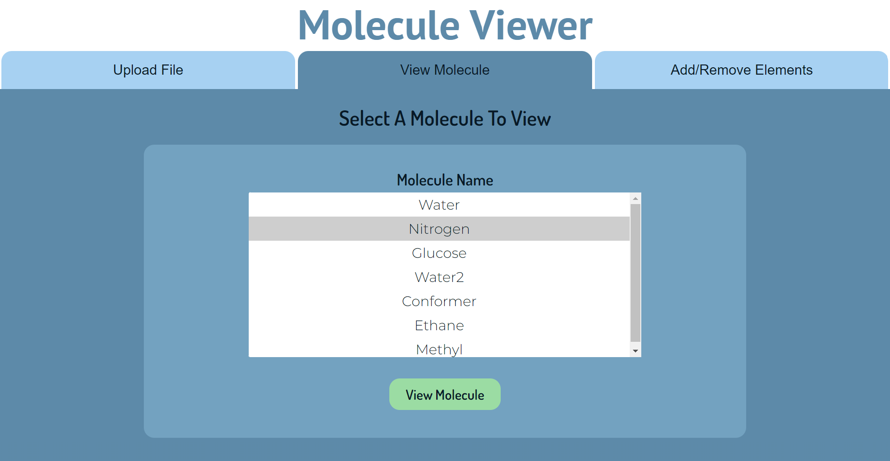
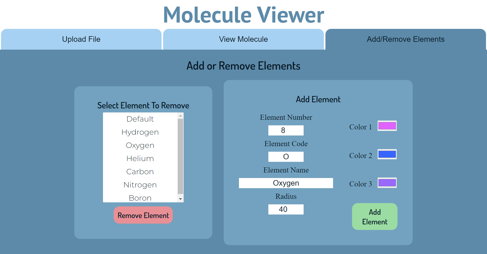
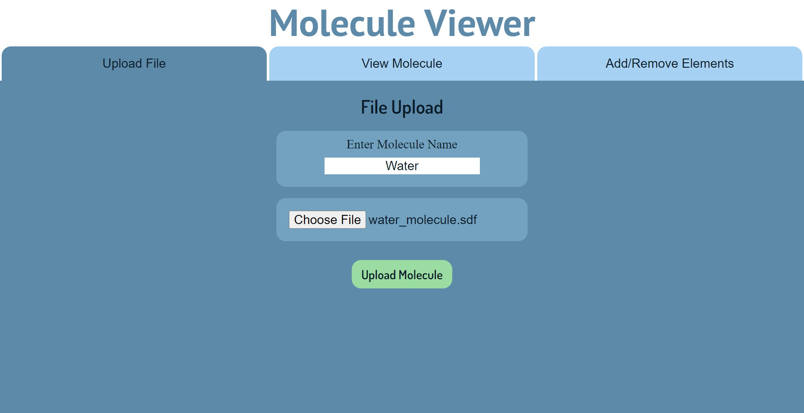

# 3D Molecule Viewer

## Run Program
```
In root directory build and run:
> docker-compose up

In browser go to:
http://localhost:8080/

example SDFs stored in ./assets/sdf_files
```


## Description
3D molecule viewer web application that allows users to upload molecule SDFs (Standard Data File) and get a 3D visual SVG representation. Users have the ability to edit elements properties including color and size, providing more customization to the displayed molecules. Built with a C library to interface with molecule data integrated with a Flask server and sqlite database. 


## Images








## Example Endpoint structures
### /molecule_list GET
Server Response:
```
{
    'molecules': [
        {
            'name': 'Water',
            'atoms: 3,
            'bonds': 2
        },
        {
            ...
        }
    ]
}
```

### /element_list GET
Server Response:
```
{
    'elements': [
        'Default',
        'Hydrogen',
        ...
    ]
}
```

### /upload POST
Server Receives: File  
Server Response:
```
{
    'message': 'status message',
    'molecule': {
        'name': 'Water',
        'atoms: 3,
        'bonds': 2
    }
}
```

### /elements PUT
Server Receives:
```
{
    'element': {
        'name': 'Oxygen',
        'code': 'O',
        'number': 8,
        'radius': 40,
        'color1': #FF0000,
        'color2': #00FF00,
        'color3': #0000FF
    }
}
```

### /elements/<element_name> DELETE
```
Delete selected element from database
```

### /molecule/<molecule_name> GET
```
Server redirects and displays selected molecule
```


## Todo
- molecule rotation through client interaction